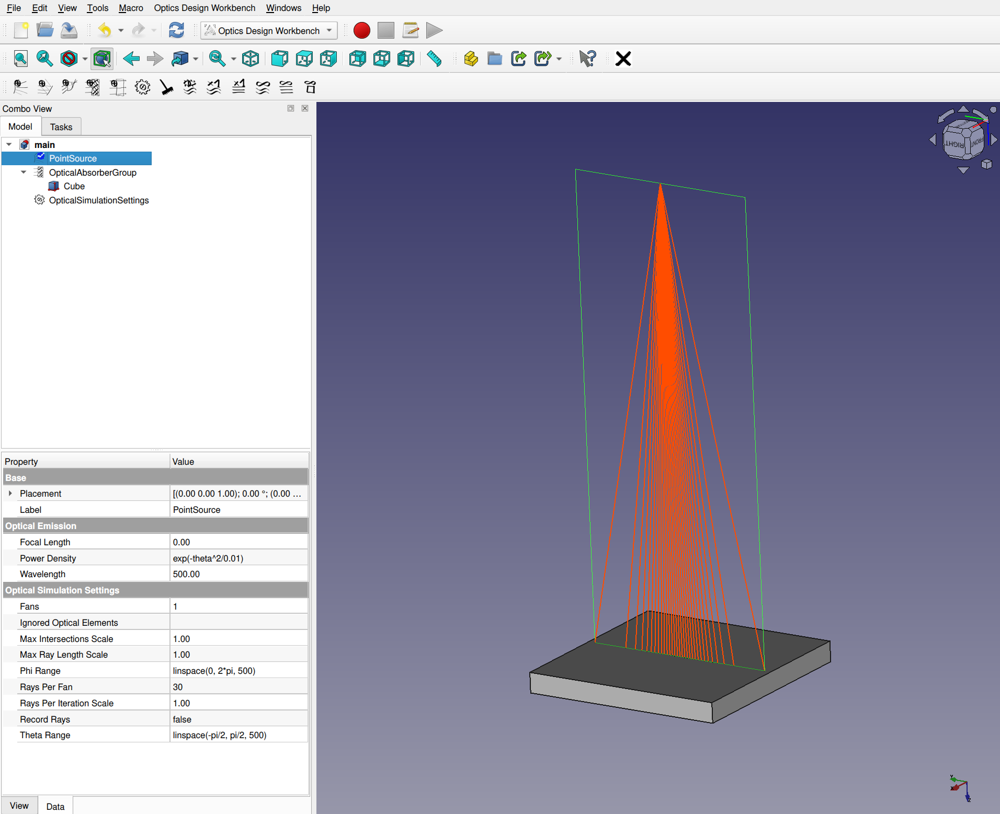
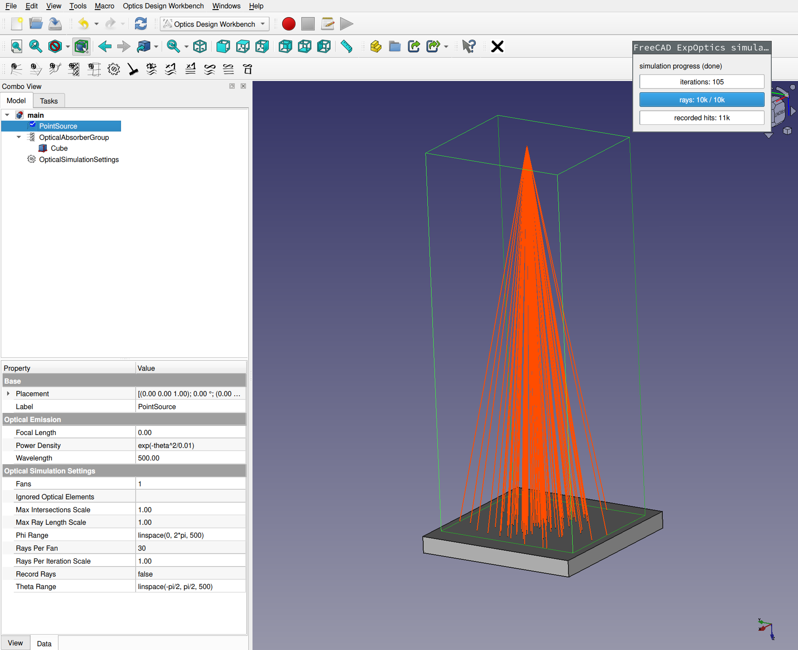
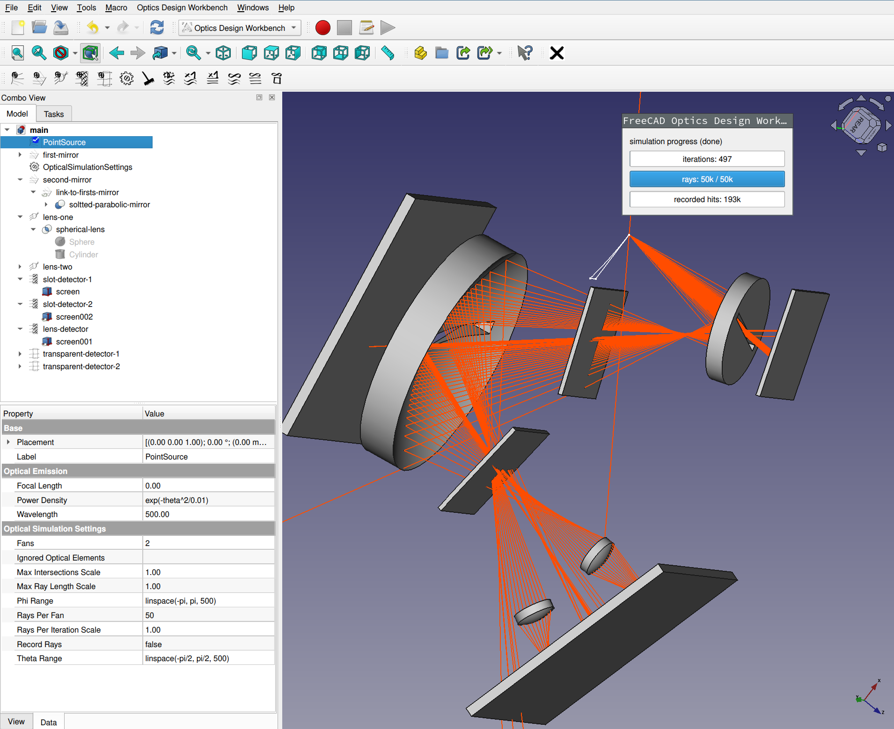

# Optics Design Workbench

This workbench was inspired by the [OpticsWorkbench](https://github.com/chbergmann/OpticsWorkbench) and aims to extend its functionality towards design and optimization of optical assemblies.

Feel free to ask any question in the [forum thread](https://forum.freecad.org/viewtopic.php?t=89264).


## Prerequisites

FreeCAD version >=0.21, python packages numpy, scipy, matplotlib, atomicwrites. A jupyter notebook installation is recommended.


## Installing the FreeCAD workbench

To make the Optics Design Workbench available in FreeCAD, install it using FreeCAD's built in addon manager.

If you want to install without the addon manager, head to the releases section and download the zipped source of your version of choice. Extract the downloaded zip to the Mod folder of your FreeCAD installation. Make sure that the folder containing the `init_gui.py` is on the third subfolder level below the Mod directory like this:

```bash
..../Mod/freecad.optics_design_workbench-1.2.3/freecad/optics_design_workbench/init_gui.py
```


## Installing for usage in external python shells and jupyter notebooks

To install as a regular python package run

```bash
pip install optics_design_workbench
```

(Note that the package looks very much like a `freecad.optics_design_workbench` namespace package, however it is uploaded to PyPi just as `optics_design_workbench`, i.e., not being part of the freecad namespace. The reason for this is that the freecad base package is not pip-installable yet and is therefore very difficult to install in virtual environments. The `optics_design_workbench` without the namespace component does not rely on the freecad package to exist, therefore can be installed via pip in any virtual environment without any issue.)


## Development installation

Clone this repository, install the python module in development mode using `pip install -e .`. Create a symlink in your FreeCAD's Mod folder pointing to the directory of the cloned directory. With this setup, changes in the cloned repository folder will be effective immediately when restarting FreeCAD. Avoid using regular PyPi or addon manager installations in parallel with the development installation.


## Getting started with examples

To get started, FCStd files and corresponding jupyter notebooks can be found the examples folder of this repository.


### Gaussian beam point source and detector

[examples/1-source-and-detector](./examples/1-source-and-detector)

#### Ray-fan simulation mode

The ray-fan mode renders rays for cross-sections of the solid angle with a spacing matching the inverse power density of the light source. This mode renders fast and gives a good first impression where the optical power of your sources ends up.




#### Monte-Carlo simulation mode

In the Monte-Carlo simulation mode, rays are placed randomly in the full solid angle according to the given power density of the light source. If the simulation is run in continuous mode, recorded ray hits will be stored to disk and can be loaded and further analyzed with the accompanying notebook in the example folder.




### Spherical lens and parabolic mirror

[examples/2-lens-and-mirror](./examples/2-lens-and-mirror)

Any geometric body in FreeCAD can become member of one of the `OpticalGroup`s to turn them into reflective, refractive, absorbing or ray-detecting objects. This example contains spherical lenses and slotted parabolic mirrors, transparent and absorbing detectors. When running the continuous simulation, folders for all objects that have set `Store Hits` to true will be generated.




### Geometry parameter optimization

[examples/3-parameter-sweeps](./examples/3-parameter-sweeps)

All parameters of the FreeCAD model are accessible from an external python shell through the `jupyter_utils` submodule. The recommended workflow is to use a jupyter notebook for such edits (hence the module name). The example shows a simple spherical lens, the radius of which is optimized to minimize the spot size on a detector.


## Troubleshooting

When things don't work as expected first make sure you are actually running want you intend to run and whether the same workbench version is installed on the python and the FreeCAD side. To check this, run

```python
import optics_design_workbench
optics_design_workbench.versionInfo()
```

in the FreeCAD python shell and

```python
import optics_design_workbench
optics_design_workbench.versionInfo()
```

in your regular python shell of choice.

Make sure that the workbench versions seen by FreeCAD and by python match and that all the displayed versions and paths match your expectations.
