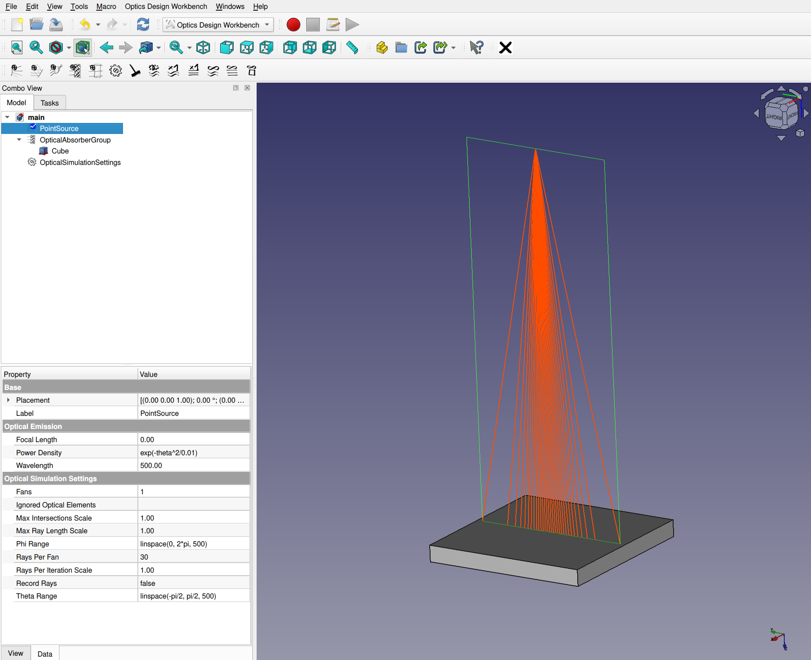
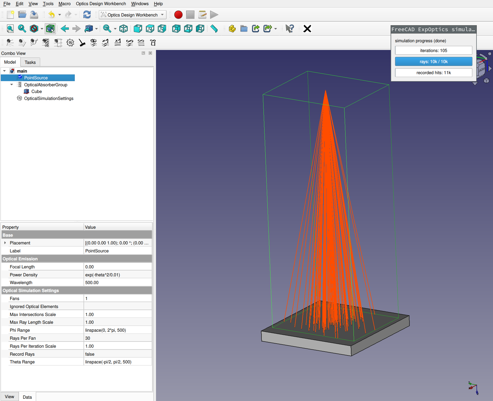
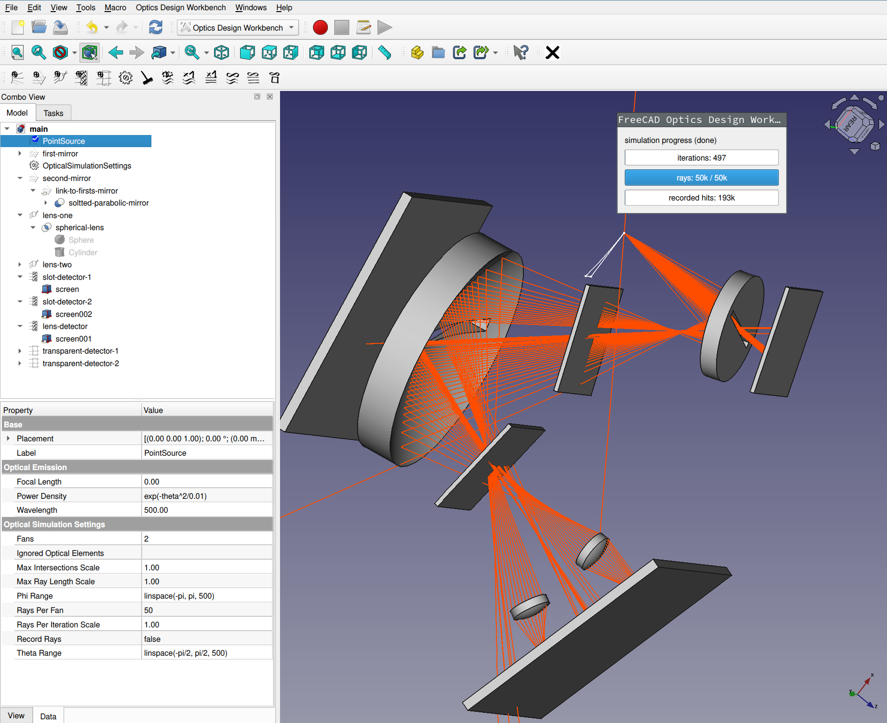

# Optics Design Workbench

This workbench was inspired by the [OpticsWorkbench](https://github.com/chbergmann/OpticsWorkbench) and aims to extend its functionality towards design and optimization of optical assemblies.

Feel free to ask any question in the [forum thread](https://forum.freecad.org/viewtopic.php?t=89264).


## Installing the FreeCAD workbench

To make the Optics Design Workbench available in FreeCAD, install it using FreeCAD's built in addon manager.

Sometimes the latest version on github is not immediately recognized by the addon manger. To ensure to update to the latest version it may be necessary to uninstall the workbench, then refresh the local cache and install the workbench again.


## Installing for usage in external python shells and jupyter notebooks

To install as a regular python package run

```bash
pip install optics_design_workbench
```

Note that from within the freecad python shell the workbench is available as a namespace package `freecad.optics_design_workbench`. 

However it is uploaded to PyPi just as `optics_design_workbench`, i.e., not being part of the `freecad` namespace, because the `freecad` package is not pip-installable nor importable in non-freecad python interpreters (yet). It is therefore difficult to install the freecad namespace base package in virtual environments. The `optics_design_workbench` without the namespace component does not rely on the `freecad' package, therefore can be installed via pip in any virtual environment without any issue.

Feel free to open an issue if a less confusing way of organizing the package exists that allows both usage in FreeCAD as a workbench and installation in non-freecad python interpreters via pip.


## Manual installation (without addon manager)

If you want to install without the addon manager, head to the releases section and download the zipped source of your version of choice. Extract the downloaded zip to the Mod folder of your FreeCAD installation. Make sure that the folder containing the `init_gui.py` is on the third subfolder level below the Mod directory like this:

```bash
..../Mod/freecad.optics_design_workbench-1.2.3/freecad/optics_design_workbench/init_gui.py
```


## Development installation

Clone this repository, install the python module in development mode using `pip install -e .`. Create a symlink in your FreeCAD's Mod folder pointing to the directory of the cloned directory. With this setup, changes in the cloned repository folder will be effective immediately when restarting FreeCAD. Avoid using regular PyPi or addon manager installations in parallel with the development installation.


## Getting started with examples

To get started, FCStd files and corresponding jupyter notebooks can be found in the examples folder of this repository.


### Gaussian beam point source and detector

[examples/1-source-and-detector](./examples/1-source-and-detector)

#### Ray-fan simulation mode

The ray-fan mode renders rays for cross-sections of the solid angle with a spacing matching the inverse power density of the light source. This mode renders fast and gives a good first impression where the optical power of your sources ends up.




#### Monte-Carlo simulation mode

In the Monte-Carlo simulation mode, rays are placed randomly in the full solid angle according to the given power density of the light source. If the simulation is run in continuous mode, recorded ray hits will be stored to disk and can be loaded and further analyzed with the accompanying notebook in the example folder.




### Spherical lens and parabolic mirror

[examples/2-lens-and-mirror](./examples/2-lens-and-mirror)

Any geometric body in FreeCAD can become member of one of the `OpticalGroup`s to turn them into reflective, refractive, absorbing or ray-detecting objects. This example contains spherical lenses and slotted parabolic mirrors, transparent and absorbing detectors. When running the continuous simulation, folders for all objects that have set `Store Hits` to true will be generated.




### Geometry parameter optimization

[examples/3-parameter-sweeps](./examples/3-parameter-sweeps)

All parameters of the FreeCAD model are accessible from an external python shell through the `jupyter_utils` submodule. The recommended workflow is to use a jupyter notebook for such edits (hence the module name). The example shows a simple spherical lens, the radius of which is optimized to minimize the spot size on a detector.


## Troubleshooting

When things don't work as expected first make sure you are actually running want you intend to run and whether the same workbench version is installed on the python and the FreeCAD side. To check this, run

```python
import freecad.optics_design_workbench
freecad.optics_design_workbench.versionInfo()
```

in the FreeCAD python shell and

```python
import optics_design_workbench
optics_design_workbench.versionInfo()
```

in your regular python shell of choice.

Make sure that the workbench versions seen by FreeCAD and by python match and that all the displayed versions and paths match your expectations.
