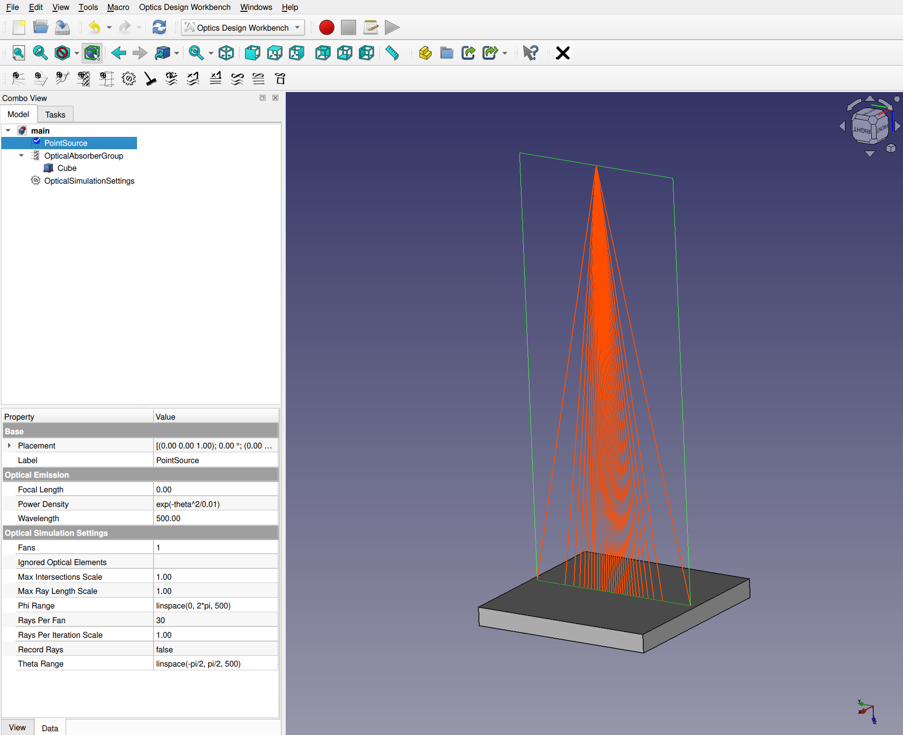
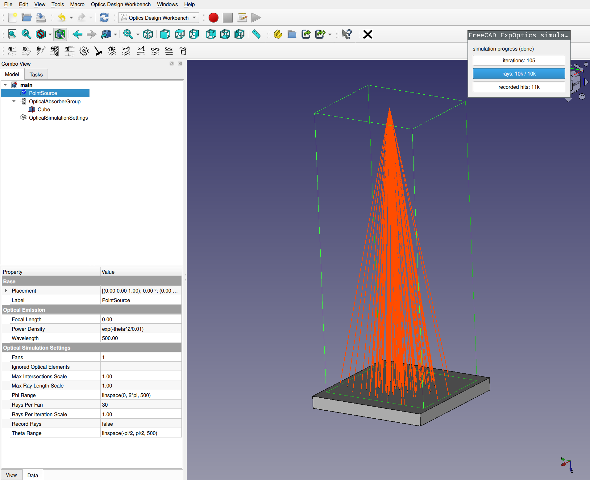
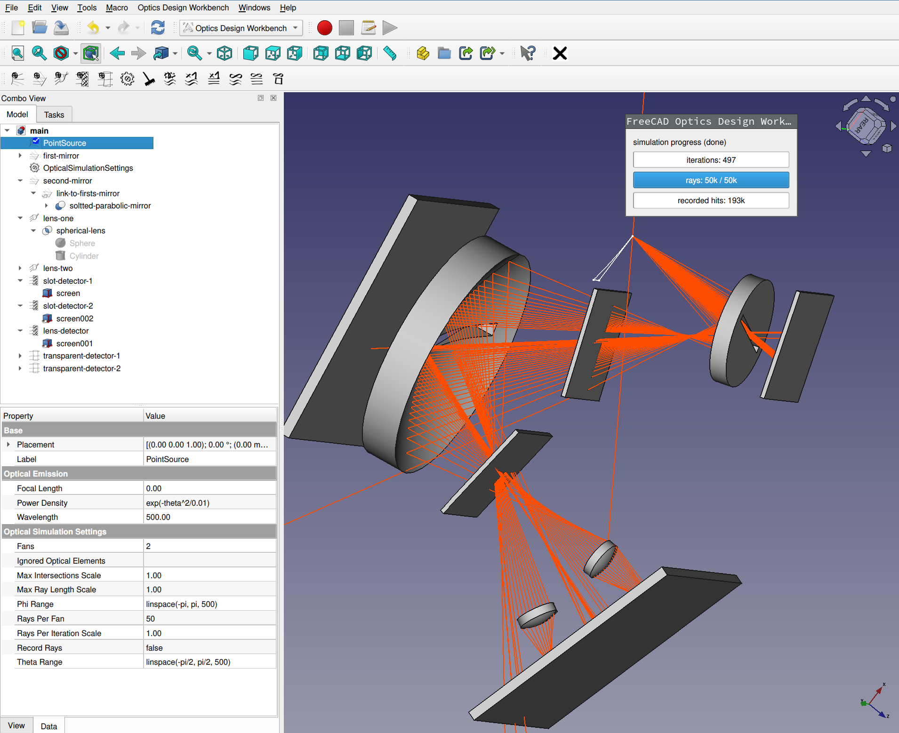

  


# Optics Design Workbench

This workbench was inspired by the [OpticsWorkbench](https://github.com/chbergmann/OpticsWorkbench) and aims to extend its functionality towards design and optimization of optical assemblies.

The [documentation](https://optics-design-workbench.readthedocs.io) is far from complete but growing.

Feel free to ask any question in the [forum thread](https://forum.freecad.org/viewtopic.php?t=89264).


## Getting started with examples

To get started, FCStd files and corresponding jupyter notebooks can be found in the examples folder of this repository.


### Gaussian beam point source and detector

[examples/1-source-and-detector](./examples/1-source-and-detector)

#### Ray-fan simulation mode

The ray-fan mode renders rays for cross-sections of the solid angle with a spacing matching the inverse power density of the light source. This mode renders fast and gives a good first impression where the optical power of your sources ends up.




#### Monte-Carlo simulation mode

In the Monte-Carlo simulation mode, rays are placed randomly in the full solid angle according to the given power density of the light source. If the simulation is run in continuous mode, recorded ray hits will be stored to disk and can be loaded and further analyzed with the accompanying notebook in the example folder.




### Spherical lens and parabolic mirror

[examples/2-lens-and-mirror](./examples/2-lens-and-mirror)

Any geometric body in FreeCAD can become member of one of the `OpticalGroup`s to turn them into reflective, refractive, absorbing or ray-detecting objects. This example contains spherical lenses and slotted parabolic mirrors, transparent and absorbing detectors. When running the continuous simulation, folders for all objects that have set `Store Hits` to true will be generated.




### Geometry parameter optimization

[examples/3-parameter-sweeps](./examples/3-parameter-sweeps)

All parameters of the FreeCAD model are accessible from an external python shell through the `jupyter_utils` submodule. The recommended workflow is to use a jupyter notebook for such edits (hence the module name). The example shows a simple spherical lens, the radius of which is optimized to minimize the spot size on a detector.


## Troubleshooting

When encountering errors please make sure that the workbench is up-to-date (Addon Manager->Optics Design Workbench->Update) and that all python dependencies have the latest version (Addon Manager->Little "gear" button->Update all python packages).

When things don't work as expected first make sure you are actually running want you intend to run and whether the same workbench version is installed on the python and the FreeCAD side. To check this, run

```python
import freecad.optics_design_workbench
freecad.optics_design_workbench.versionInfo()
```

in the FreeCAD python shell and

```python
import optics_design_workbench
optics_design_workbench.versionInfo()
```

in your regular python shell of choice.

Make sure that the workbench versions seen by FreeCAD and by python match and that all the displayed versions and paths match your expectations.
