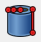
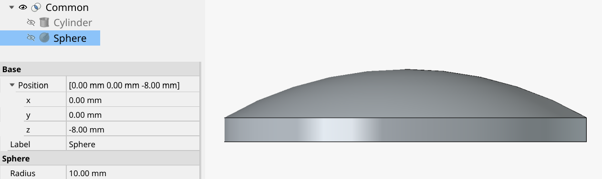
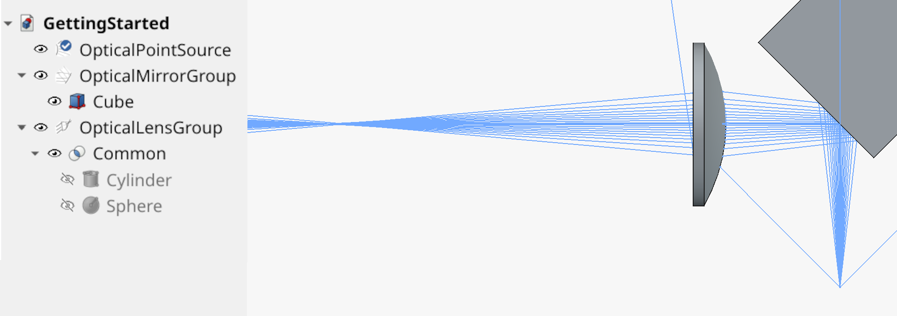
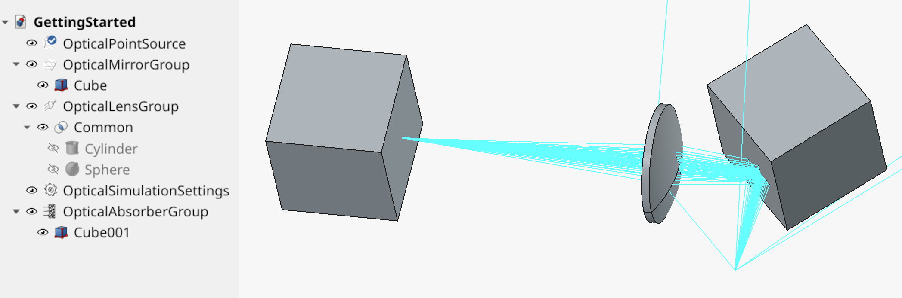

FreeCAD integration
===================

To make the optics design workbench available in FreeCAD open the Addon manager (Tools -> Addon Manager -> Search for `optics_design_workbench` -> open workbench page -> install). The Addon manager will install the workbench and all required python packages.

.. _`available on github`: https://github.com/zaphB/freecad.optics_design_workbench/tree/master/examples/1-getting-started

For the impatient, the .FCStd file discussed in this chapter is `available on github`_.

Tracing our first rays
----------------------

.. |add-point-source| image:: _static/icons/add-pointsource.svg
  :height: 18pt

.. |fans| image:: _static/icons/fans.svg
  :height: 18pt

.. |singlepseudo| image:: _static/icons/singlepseudo.svg
  :height: 18pt

.. |singletrue| image:: _static/icons/singletrue.svg
  :height: 18pt

.. |pseudo| image:: _static/icons/pseudo.svg
  :height: 18pt

.. |true| image:: _static/icons/true.svg
  :height: 18pt

Select |workbench-dropdown| in the workbench menu to open the optics design workbench. Add a point source using the add point source |add-point-source| button. A new entry in the document tree appears called `OpticalPointSource`. Make sure the .FCStd document is saved to disk (required to generate rays) and press one of the ray generation buttons |fans|, |singlepseudo|, |singletrue|, |pseudo|, |true|. Rays emitted by the light source should appear in the GUI.

+-------------------------------------------------+------------------------------------------------------+
| .. figure:: _static/basics/pointsource-fans.png | .. figure:: _static/basics/pointsource-true.png      |
|   :height: 300pt                                |   :height: 300pt                                     |
|                                                 |                                                      |
|   Generated point source rays in *fan mode*.    |   Generated point source rays in *true random mode*. |
+-------------------------------------------------+------------------------------------------------------+

We will come back to the different generation modes later in this chapter in section `Fan mode and Monte-Carlo mode`_. For now we continue with adding a few more components to our beam path.

.. |clear| image:: _static/icons/clear.svg
  :height: 18pt

.. |stop| image:: _static/icons/stop.svg
  :height: 18pt

Use the |stop| button to stop a running ray-generation process. The |clear| button cancels the process and removes all generated rays from the 3D view.

Adding a mirror
---------------

.. _`Part workbench`: https://wiki.freecad.org/Part_Workbench

.. |addmirror| image:: _static/icons/add-mirror.svg
  :height: 18pt

To create a mirror, we first have to create a geometric body that we want to define as a mirror. For this simple example switch to the `Part workbench`_ to create a Cube primitive. Then switch back to the optics design workbench. Select the cube, then press the `make mirrors` |addmirror| button. This will create a new *OpticalMirrorGroup* in the document tree and add all selected objects to it. After creating the mirror group you can add or remove tree objects to the group using drag and drop. All objects added to the mirror group will reflect rays that hit them.

Now let's move that Cube, e.g. by changing its placement, such that it intersects with the rays emitted from the point source. Rotate the cube by 45° to avoid reflecting the rays directly back at the source. Now press one of the ray generation buttons |fans|, |singlepseudo|, |singletrue|, |pseudo|, |true| to recalculate the rays, et voila, your first mirror simulation!

+-------------------------------------------------------+---------------------------------------------------------------------------------------------+
| .. figure:: _static/basics/mirror-and-source-tree.png | .. figure:: _static/basics/mirror-and-source-rays.png                                       |
|   :height: 350pt                                      |   :height: 350pt                                                                            |
|                                                       |                                                                                             |
|   Tree view of the current example project so far     |   Rays generated by the point source in *fan mode*. The 45° mirror redirects the light.     |
|   and placement properties of the Cube.               |                                                                                             |
+-------------------------------------------------------+---------------------------------------------------------------------------------------------+

Adding a spherical lens
-----------------------

Adding a lens works very much analogous to the creation of a mirror in the previous section, except that we use the OpticalLensGroup instead of the mirror group. We start by creating the geometry, then we add it to an OpticalLensGroup.

For this tutorial we will create the geometry for a plano-convex spherical lens with the help of the Part workbench. We add a cylinder |cylinder| and a sphere |sphere| primitive and combine them using the intersection boolean operation |intersect|. Tweak the dimensions and placement of the two objects to obtain any lens that you like. For this guide I decided to pick a sphere radius of 10mm and shift the sphere a little to make a flat plano-spherical lens:

.. |addlens| image:: _static/icons/add-lens.svg
  :height: 18pt

Then make sure the lens object is selected and create the optical lens group |addlens| (or for some change: create the group without any selection and add the lens using drag-and-drop!). Finally move and rotate the lens to a place that intersects with the point source's rays. In my example I shifted the lens here and regenerated rays in fan mode:

  Tree and 3D view of the example with one mirror and the plano-convex lens. The .FCStd file discussed in this example chapter is `available on github`_.

Feel free to play with the lens position, radius, mirror angle and see hat happens with the light! Remember to press one of the ray generation buttons to re-trace all rays after making a change to the geometry. If you feel like playing more with lenses and mirrors feel free to create more geometry (or links to existing geometry) and add them to existing or additional mirror and lens groups. I used the Part workbench primitives and boolean operations in this examples but you can use any other workbench you want, add links to external FreeCAD documents or import a step file. A parabolic mirror or a Galilean telescope are just a few clicks away...

Fan mode and Monte-Carlo mode
-----------------------------

After familiarizing ourselves with the most important optical elements it is time to take a closer look at the simulation modes: 

|fans| **Ray fan mode** is intended to create a quick overview of where light is going. It places one or more sets of rays with the same azimuth and varied polar angle in a pattern reminiscent of a fan. The rays of a point source in fan mode are placed such that the distance of neighbor rays is proportional to the inverse emitted power density of the the light source at that angle. A source with equal emission power density in all directions will generate equidistant rays in fan mode. A Gaussian point source will emit densely spaced fan rays close to the optical axis and rays with wider spacing further away from the optical axis. To customize fan properties such as number of fans or rays per fan, see the properties of the *OpticalPointSource*. 

|singlepseudo| **Single pseudo random simulation** and |singletrue| **Single true random simulation** place rays at randomized angles such that the the average number of rays in a given direction matches the configured emission power density of the source. The pseudo random simulation uses a pseudo random number generator that suppresses statistical outliers and thus may converge to a smooth distribution a little faster. The true random simulation uses a mathematically sound random number generator that considers all drawn random numbers. The simulation stops if one iteration is complete.

|pseudo| **Continuous pseudo random simulation** and |true| **Continuous true random simulation** place rays the same way that the single shot simulations do, but do not stop after one iteration. Instead, when an iteration is completed, all generated rays are cleared from the GUI and a new iteration is started. In these continuous simulation modes, all optical objects that have their *Store Hits* property set to true and all light sources that have their `Store Rays` property set to true, will store their respective hits or ray-traces to disk. These modes are intended to generate the large data sets needed to analyze optical power densities arriving at the various optical objects in the simulation and are therefore often referred to as *Monte-Carlo modes* in this guide.

Adding a Simulation Settings object
-----------------------------------

.. |add-settings| image:: _static/icons/add-settings.svg
  :height: 18pt

Use the *make simulation settings* |add-settings| button to add an *OpticalSimulationSettings* object to the document tree. This object does not contain any geometry but only a number of properties to customize simulation sizes, tolerances, select information to store. Without a simulation settings object in the project all configuration values are assumed to have their default values.

Multiple *OpticalSimulationsSettings* are allowed in a project to conveniently switch between e.g. coarse and fine simulation settings. Only one of them can have its *Active* property set to *True*. The *Active* property is kept in sync with the *Visibility* view property, therefore an inactive simulation settings object can conveniently be switched to *Active=True* by selecting it and pressing space. Switching a simulation settings object to *Active=True* will automatically set all other settings objects to *Active=False*.

Adding a detector
-----------------

After learning how to setup and configure ray tracing simulations, our next and final task for this chapter will be to simulate and visualize the power density at a given beam cross section.

.. |add-absorber| image:: _static/icons/add-absorber.svg
  :height: 18pt

.. |add-vacuum| image:: _static/icons/add-vacuum.svg
  :height: 18pt

In principle, any of the mirrors and lenses that you have already added can become a detector by changing its `Record Hits` property to true. In practice, usually one wants to calculate power densities not exactly at a lens or mirror, but at other parts in the beam path. For this reason, the `OpticalVacuumGroup` |add-vacuum| and `OpticalAbsorberGroup` |add-absorber| objects exist. As for lenses or mirrors, any geometry added to these groups will act as an absorber or as vacuum. The Vacuum group may be a bit confusing, because geometry that is not part of any optical group behaves like vacuum, too. But the vacuum group allows to set `Record Hits` to True, serving as a transparent detector. The `optical absorber` group can be used as an absorbing detector (Record Hits=True) or as a simple absorber without any detection (Record Hits=False). 

For this tutorial, lets add an absorbing detector at the end of the beam. I used another Cube primitive from the Part workbench, created an `optical absorber group`, made sure its `store hits` property is set to True and shifted the geometry to the approximate focal point of our beam: 

  Tree and 3D view of the example with one mirror, the plano-convex lens, the simulation settings object and an absorber that serves as a detector. The .FCStd file is `available on github`_.

Next, set the *End After Rays* property of the *OpticalSimulationSettings* object to 1e5 (=100,000) and press `start true random simulation` |true|.

A little window with progress bars pops up and displays how the simulation is going. You should also see that the cpu load jumps to 100% potentially hear your PC's fans ramp up. By default the Monte-Carlo simulations use all available cpu cores. You can customize the number of used cpu cores by the simulation settings property `Worker Process Count`. While the simulation is busy feel free to open the folder containing the .FCStd file. You should now see a folder with the same name ending in `OpticsDesign` alongside with the .FCStd file. Assume we named the project *GettingStarted.FCStd*, the subfolder *GettingStarted.OpticsDesign/raw/run-000000* contains the raw results of all simulations that you just started. Every simulation you start will create a new enumerated subfolder in *GettingStarted.OpticsDesign/raw/*.

In the next chapter, we will visualize the simulated power density using a jupyter notebook!
